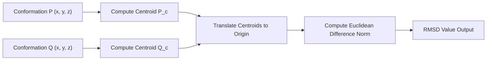

# Molecular RMSD Superposition Skill

Geometric coordinate superposition and Root Mean Square Deviation (RMSD) tool for comparative structural chemistry and biology.

## Features
- **100% Python Standard Library**: Pure Euclidean geometry.
- **Centroid Centering**: Invariance to spatial coordinates translation.
- **Fast Atom Superposition**: Instant scoring for molecular docking and dynamics.
